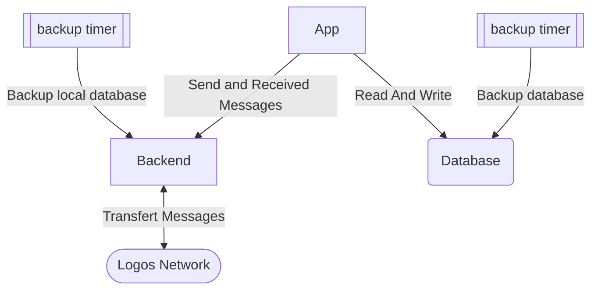

# Description

This role configures a [Status Bot](https://github.com/status-im/status-bot), on automate for StatusApp.

# Architecture



The deployement will setup 3 containers:
* Backend, a Status Go instance to connect to the network
* App, the StatusBot instance
* Database, a Postgresql instance

2 Systemd timer are set to backup the Database and Backend sqlite database.


# Configuration

## Mandatory parameters

```yml
# Account configuration
status_bot_app_username:            'botty-mac-bot'
status_bot_app_password:            'ChangeMeIfYouCare'
status_bot_app_passphrase:          'test test test test test test test test test test test'
status_bot_app_compressed_key:      'account-compressed-key'
status_bot_app_coingecko_api_key:   'some-api-key'
status_bot_app_infura_key:          'some-api-key'
status_bot_config_hash_pepper:      'Pepper used for data hashing'

# Database configuration
status_bot_db_admin_user: 'status-bot'
status_bot_db_admin_pass: 'ChangeMeIfYouCare'
status_bot_db_repl_user: 'repl'
status_bot_db_repl_pass: 'some-other-pwd'
```

## Optional parameters

To add an authentication key to the API, set the following variable.

```yaml
status_bot_app_api_key: 'api-key'
```


To copy another profil picture, set the following variables:
```yaml
status_bot_profile_picture_local_path: 'local/path/to/image.png
status_bot_config_profile_picture:     'image_name.png'
```

## Modules configurations

To select wich module is active, make a configuration for each one depending on the parameters the module need:


```yaml
status_bot_app_modules_enabled: ['engagement', 'receiver', 'community_monitoring', 'messaging']
status_bot_app_modules_settings:
    engagement: {}
    community_monitoring: {}
    receiver: {}
```

For more information of the configuration of each modules, look at the [documentation](https://github.com/status-im/status-bot/tree/master/docs/usage)
